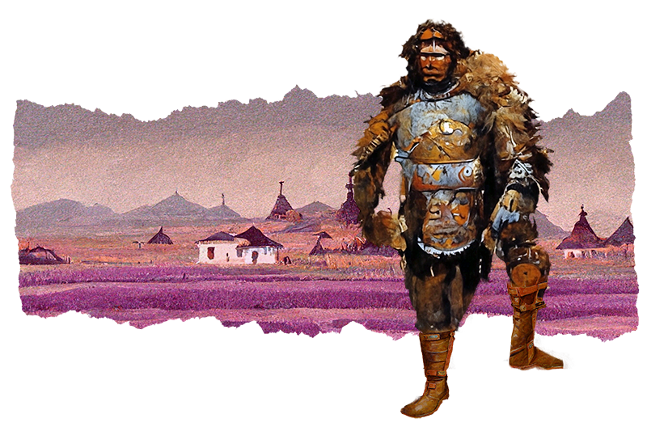

# Cro-Mag



## Overview

Cro-Mags have roughly the same cognitive abilities and variance as other humans, but have a slightly different physique, being broader and shorter, with a more pronounced brow.

## Attributes

### Ability Score Increase

- **Ability Scores** Two different ability scores of your choice increase by 1.

### Proficiencies

- You gain proficiency in one skill of your choice

### Feat

- You gain one feat of your choice.

**note**

```
Rule Variant Humans:
For the purposes of any mechanic that specifies Human, that mechanic also applies to Cro-Mags.
```

## Characteristics of Cro-Mags

### Physical Appearance

- **General**: Similar physique to humans
- **Brow**: Cro-Mags have a more prononuced brow.
- **Stature**: Slightly broader and slightly shorter than humans.

### Culture and Society

- Todo

## Playing as an Cro-Mag

### Class Synergy

- **Figher**: Stocky fighting bodies.

### Strengths

- todo

### Weaknesses

- todo

## Conclusion

Get out there and have fun.
